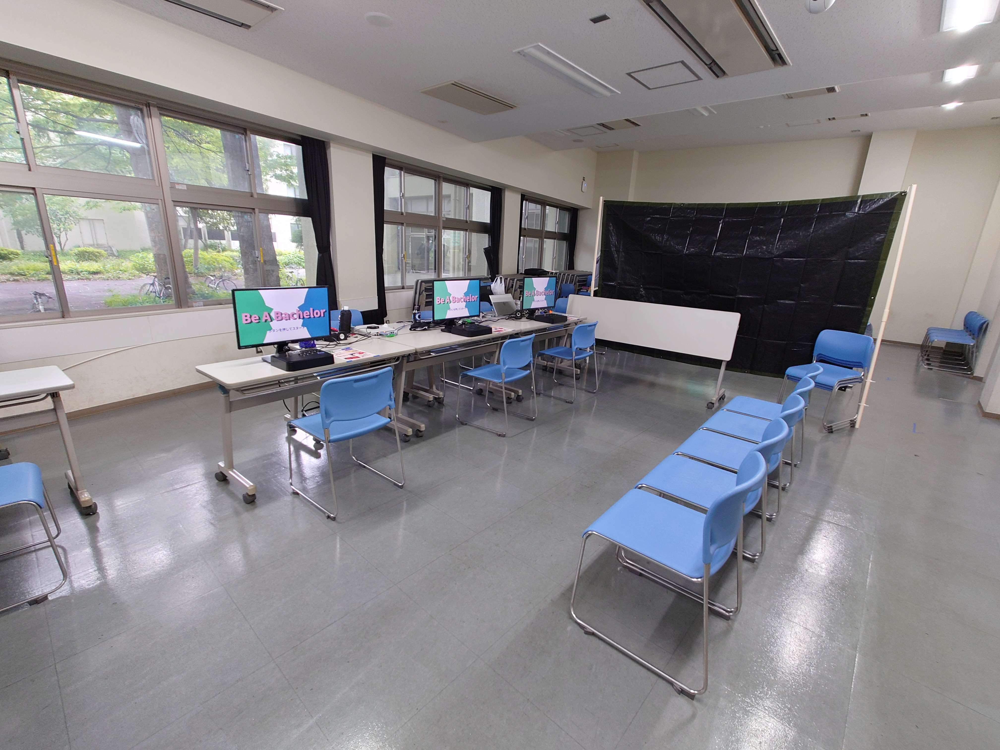
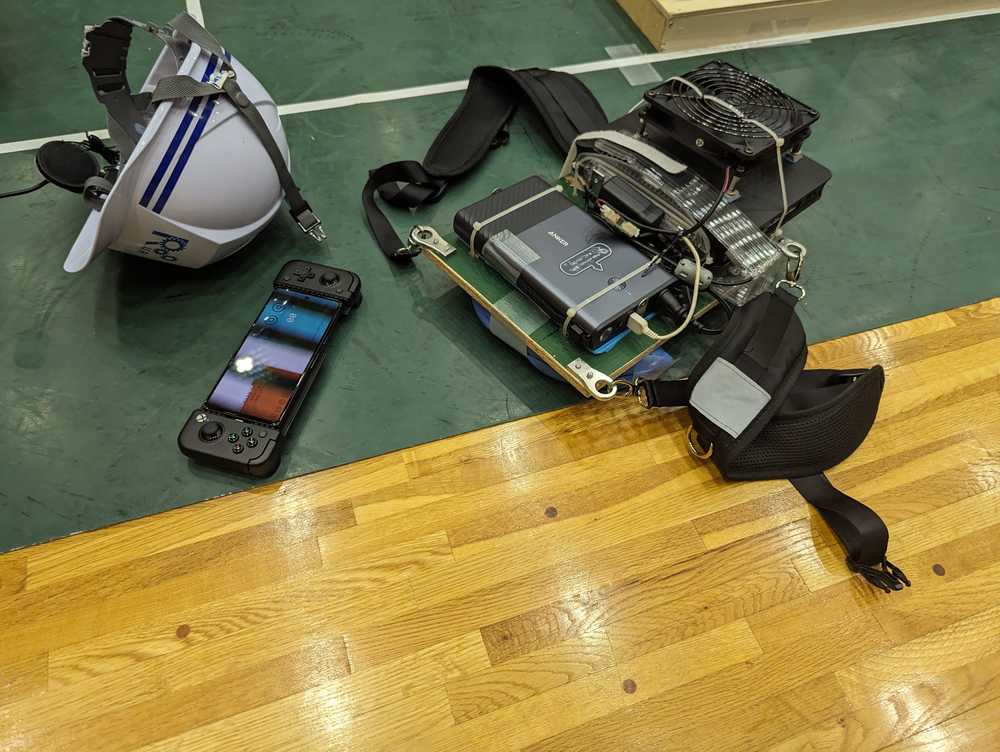
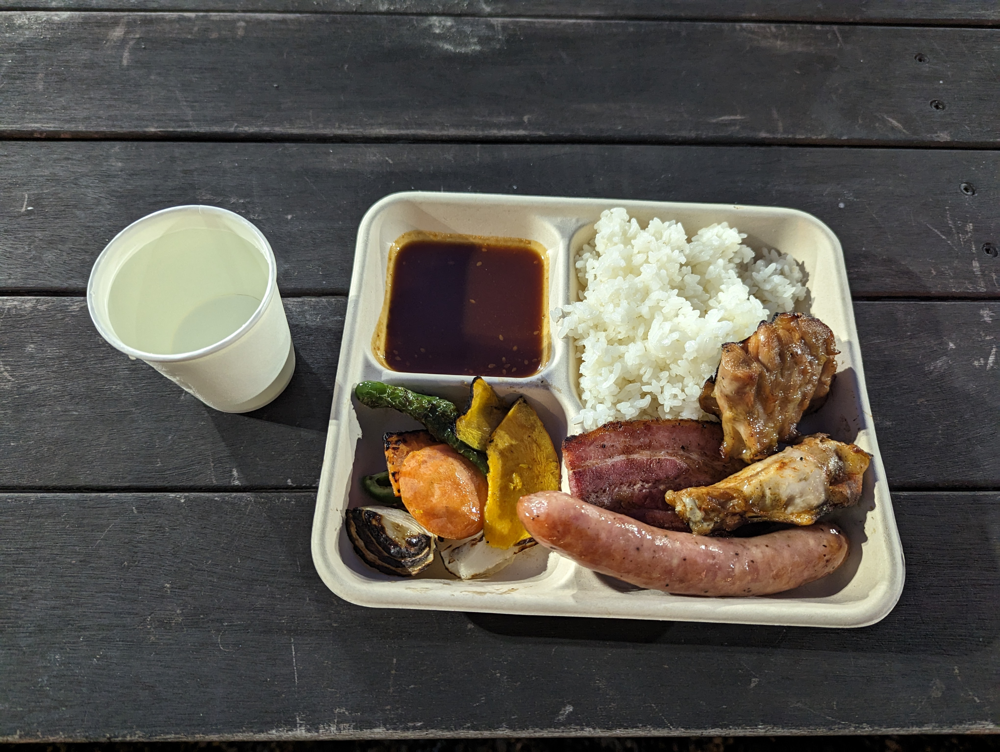
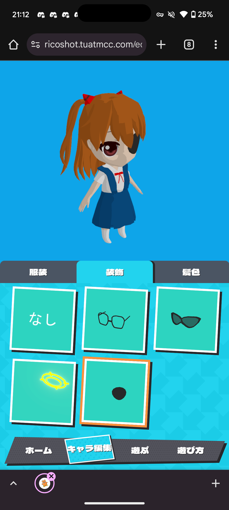

みんな書いてるので書いてみようと思ったなのです。時系列順、とても適当。

## 特に何もしていない

1~3月くらい、一週間でマーケティングと英語の2科目しかない(私文ですか)のに週6で大学に来ていたが、特に何もしていない気がする。

所属サークルのMCCにあまりに入り浸っていたせいか、この頃から部室に人が増えた。あとボードゲームも増えた。

## MCC春合宿

MCCの2泊3日の開発合宿。山梨の合宿所にしてみたが、交通の便がしんどかったのでもうこないからねー。施設の人は優しかったけれども。

準備とか運営とかやった。MCCに入部以来初めてちゃんと仕事をした気がする。

## 編入学

裏ルートで学籍を変えた。入学式にはいかずに部室に行って、入部フォーム作ってた(そして自分で出した)。

## 新歓イベント系

LTいっぱいあった気がする。新入生の前で「Windowsの設定をカスタマイズしてLinuxみたいな使い勝手にする」的な発表してしらけさせた記憶。

## MCCの部長になった

MCCで1年生の頃から在籍・活動してる人の中で一番コアなメンバーだったので、順当な流れで部長になった。一応入学ホヤホヤなんだけどね。リーダー気質は全くないが、いい経験になるかぁと。

## 工学部祭(MCC)

昨年作ったゲーム＋春休み作ったゲームを出した。基本的に開発メンバーの4,5人で全部回してたので忙しかった。

## NHK学生ロボコン

実はサークル掛け持ちしていて、ロボット研究会R.U.R部員でもある。まぁ本当にだらだらとスマホコントローラーを開発していて、一応本番に間に合ってちゃんと動いたので、続けてきた甲斐があったなと思った。非幽霊部員の中でも貢献度はトップレベルに低かったが、まぁロボットは好きだし、一回もまともに大会に成果を出せずには引けないと思ってた。

## 技育博に出た(MCC)

前部長が出そう！って言って出した。

前の農学部祭で作ったモーションキャプチャーのゲームをもっていったが、他の出展者はWEB系統が多く、毛色の違いを感じた。

## ICPCの国内予選 (MCC)

NHKロボコン終わったら競プロやる〜って言ってた割に全然時間がなかった。参加するだけ参加した。来年はもう少しマシだといいな(願望)

## エヴァを観た (MCC)

夏休み毎日部室に行ってエヴァンゲリオン鑑賞会をやっていた。見てみたら崩壊3rdの元ネタだとわかりドハマリした。そしてこの辺りから崩壊3rdオタクレベルが上がった。

## Hack U Tokyo 2024 (MCC)

高専編入のつよつよに引っ張ってもらった。WEBフロントエンドの知識がちょっとだけ増強された。他のチーム、意識高くないですか。

## MCC夏合宿

前は16人位だったのにいきなり30人超えでびっくり。集合場所来て「なんだこの人混みは」と思った。ところどころグダったけれど、毎回の合宿の流れを踏襲しているだけなので無事に終わった。ありがとう先輩たち。

↑BBQ

## 農学部祭(MCC)

WEBとUnityに分けて開発した。個人的にはキャラクター5体のモデリング・リギング・アニメーションあたりをやれて満足した。一方でUnity側が手薄になったのと、(後輩育成的な面で)一年生のコードのレビューができなかったのが残念。タスクの振り分け難しすぎませんか。

↑エヴァ全完したその日に作ったモデル

## 技育展2024(MCC)

Hack U で作ったやつを出したら何故か決勝大会まで行った。学園祭に全力を注いでいたので本当に何もしていなくてすみません。

## ISUCON(MCC)

何もしていない。一応スコアはちょっと改善した。来年はマシだといいな(願望)

## まとめ

あまり何もしていない気がするが、たぶん気のせい。ほとんどMCCだ。
