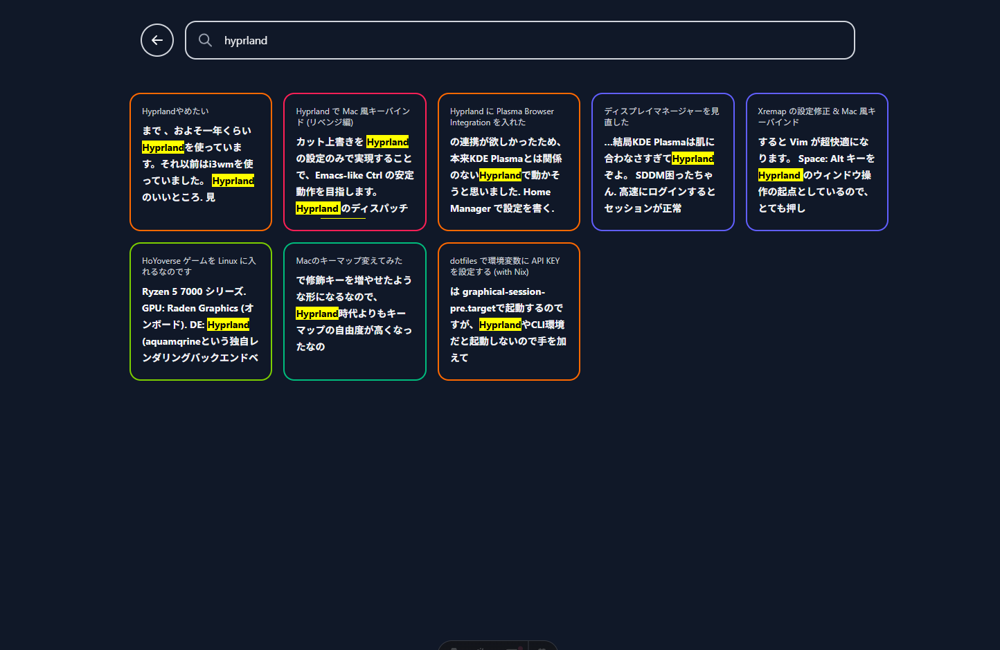

ブログに全文検索機能を追加したなのです。

## 全文検索の機能

[Pagefind](https://pagefind.app/) という静的サイト向けの全文検索エンジンを使いました。

Pagefind が全てえらいです。

## Pagefind の導入

[astro-pagefind](https://www.npmjs.com/package/astro-pagefind) という Astro 用のラッパーがあるので、それを使いました。

## UI のカスタマイズ

Pagefind がデフォルトUIを提供しており、`astro-pagefind` もそれを使っているので、少々カスタマイズして使うとお手軽です。

が、 こだわりたかったのでAPIを直接使うことにしました。
↓このサイトが参考になりました。

<https://necco.inc/note/38263/>

ビルド時に生成されるJSを使用するスクリプトなので、`<script is:inline>` を使う必要があり、TypeScriptが使えなかったり、`pagefind`オブジェクトが`any`型になったりと、結構しんどいのですが、見た目のこだわりに犠牲はつきものです。いずれなんとかしたい。

今のところこんな感じです。画像だとわからないのですが、ViewTransition も使っています。
Pagefind のドキュメントを流し見る限りでは、タグのみでの絞り込みもできそうなので、将来的にはタグ絞り込みも実装したいです。

## まとめ

Pagefind を使うと簡単に全文検索が実装できるなのです。
