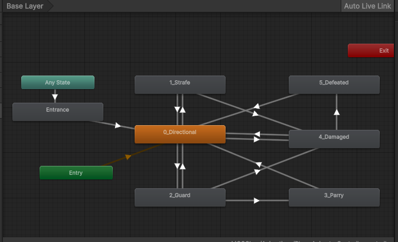

[農工大アドベントカレンダー2025](https://qiita.com/advent-calendar/2025/tuat) の記事です。

## はじめに

大学の学祭でゲームを制作しました

三人称視点の3Dキャラのアニメーションと移動の制御をしたので、そのあたり(特にプログラムの方)について書きます。

この記事でのポイントはステート管理をするところです。複雑な条件分岐を生のユーザー入力とフラグだけで処理するのはしんどいですからね。

## 仕様の整理

PvPで魔法を打ち合うゲームで、JoyConのボタンや振りに応じてチャージ、攻撃、ガード、パリィ、などのアクションを行います。

例えば、パリィは、ガード中にタイミング良くJoyConを振りながらガード解除をすると発動し、魔法を跳ね返せる、などといったことが決まっています。

## ステートの洗い出し&遷移の洗い出しをする

キャラの挙動として意識した要素は大きく分けて2つです。

1. アニメーション
2. ユーザーの操作による移動

この2つを意識しながら、まずはキャラクターの挙動をステートとして書き出します。

ステートの洗い出しとほぼ同時に、遷移の洗い出しも行います。

チャージ中にガード入力してもガードはできない、などの細かい仕様をここで詰めていくと、ChargeステートからGuardステートに遷移できない、などの制約が見えてきます。

## ステートを定義する

洗い出したステートを `enum` として定義します。

```cs
/// <summary>
///     インゲームでのプレイヤーのステート
///     ----------------------------------------------------
///     起こり得るステートの遷移
///     - WalkAndRun -> Charge | Guard | Damaged
///     - Charged -> WalkAndRun | Guard | Damaged | Charge
///     - Charge -> Charged | WalkAndRun | Damaged
///     - Guard -> WalkAndRun | Parriable
///     - Parriable -> WalkAndRun | Parried
///     - Parried -> WalkAndRun
///     - Damaged -> WalkAndRun | Defeated
///     - Defeated -> WalkAndRun
///     ステートに関係なく発生しうるイベントの有効無効の判定
///     - 攻撃は Charge ステートかどうかをよしなに見ながら行なう
///     - 被弾はWalkAndRun,Charge,Charged中のみ有効(パリィ早すぎの被弾も遅すぎの被弾もWalkAndRunステートに戻ってから起こる)
/// </summary>
public enum PlayerState
{
    WalkAndRun = 0, // よくある三人称視点操作
    Charge = 1,     // 移動できるが、常に相手をむいたたままカニさん歩き(上半身は何か溜めてる風)
    Guard = 2,      // 移動できるが、常に相手をむいたたままカニさん歩き(上半身は何か構えてる風)
    Parriable = 3,  // 見た目と動きはGuardと同じ。パリィ受付時間
    Parried = 4,    // パリィアニメーション。移動は受け付けない。
    Damaged = 5,    // 被弾アニメーション。移動は受け付けない。
    Defeated = 6,   // KOアニメーション。移動は受け付けない。
}
```

パリィの条件が若干複雑だったので、パリィの受付時間という内部的な処理のためにParriable ステートを設けていますが、Guardステート内でサブステートを切り、GuardingとParriable、みたいな方がベターだったかも……

## ステートを持つクラスを作る

```cs
using R3;

public class PlayerContext {
    public ReactiveProperty<PlayerState> State { get; private set; } = new(PlayerState.WalkAndRun);
}
```

`ReactiveProperty` を使うとステートの変更を監視できて便利です。このクラスはDIするなりなんなりで、プレイヤーの各コンポーネントに共有されるようにします。

## ステートの変更を行うクラスを作る

ステートの変更を行うだけのクラスを作り、ステートの変更となるイベントやObservableを購読してステート変更を行います。

例えば、Charge入力を受け取って、Charge ステートへ移行する場合は以下のようになります。

```cs
// WalkAndRun -> Charge
_inputHandler.PlayInputRx.OnChargePush
    .Where(_ => IsCurrentPlayerState(PlayerState.WalkAndRun))
    .Subscribe(_ => _playerContext.ChangeMyPlayerState(PlayerState.Charge))
    .AddTo(this);
```

また、例えばスタミナを使い切ってしまった場合に自動的にガードを解除する処理は以下のようになります。

```cs
// Guard -> WalkAndRun (by Stamina Shortage)
_staminaManager.CurrentStaminaState
    .Where(state => state == StaminaState.Recovering &&
                    IsCurrentPlayerState(PlayerState.Guard))
    .Subscribe(_ => _playerContext.ChangeMyPlayerState(PlayerState.WalkAndRun))
    .AddTo(this);
```

他にも、アニメーションの終わりがステートの終わりとなるパターンでは、`Animation Clip`からイベントを呼びだしてステートを変更することもあります。

```cs
// Damaged -> WalkAndRun
_playerAnimationEventHandler.OnDamagedAnimationEnd
    .Where(_ => IsCurrentPlayerState(PlayerState.Damaged))
    .Subscribe(_ => _playerContext.ChangeMyPlayerState(PlayerState.WalkAndRun))
    .AddTo(this);
```

このようにして、前項で洗い出したステートの遷移をひととおり実装していきます。

(`_inputHandler` や `_staminaManager`、`_playerAnimationEventHandler` はそれぞれ入力管理、スタミナ管理、アニメーションイベント管理を行う独自のクラス・ラッパーです。)

## ステートに応じた挙動を実装する

あとは、`PlayerContext` の `PlayerState` を見ながら、各コンポーネントで挙動を制御していくだけです。流石に一つのクラスに全て書くわけにはいかないので、各ステートごとに挙動を処理するハンドラクラスを作成し、`Update` メソッドなどで `PlayerState` に応じて呼び出すようにします。

```cs
private void Update()
        {
            switch (_playerContext.Value.PlayerState)
            {
                case PlayerState.WalkAndRun:
                    _locomotionWalkAndRunHandler.HandleWalkAndRunMovement(_moveInput, _isSprintRequested);
                    break;
                case PlayerState.Charge:
                    _locomotionChargeHandler.HandleChargeMovement(_moveInput);
                    break;
                case PlayerState.Guard:
                case PlayerState.Parriable:
                    _locomotionGuardOrParriableHandler.HandleGuardOrParriableMovement(_moveInput);
                    break;
                case PlayerState.Parried:
                    _locomotionParriedHandler.HandleParriedMovement();
                    break;
                case PlayerState.Damaged:
                    _locomotionDamagedHandler.HandleDamagedMovement(_hitLevel);
                    break;
                case PlayerState.Defeated:
                    _locomotionDefeatedHandler.HandleDefeatedMovement();
                    break;
            }
        }
}
```

この `*Handler.Handle*Movement` メソードの中で、`transform` の移動や `AnimatorController` のステート変更等を行います。

ちなみに、今回のゲームで作成した AnimatorController は以下のような見た目になっており、`int` 型のパラメーターを `PlayerState` の `enum` と対応させることでステートを遷移させています。プログラム上のステートとアニメーションのステートの同期は自分で担保する必要があるのがやっかいですね....



アニメーションの制御には Unity の Animator Controller を使用します。使いかたは[このへん](https://eda-inc.jp/post-1830/)とかを見ると良いのではないでしょうか。

## 実際のところ

私は小さく動くものをコツコツ作るタイプなので、ステート設計を最初にガッとやってから実装に入る、というよりは、ある程度動くプロトタイプを作ってからステート設計を見直して整理する、という流れが好きです。今回はプロトタイプはコーハイに作ってもらっていました。

ともかく、こんな感じで整理していくと、コードが見通しやすくなると思います。

## まとめ

ステートを整理すると、複雑な条件分岐を避けられて幸せだったよ、というお話でした～。
