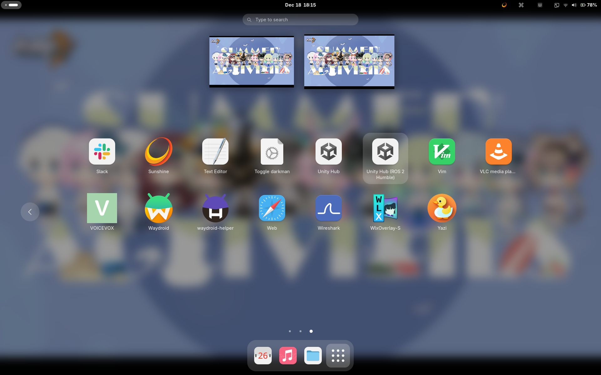

[農工大アドベントカレンダー2025](https://qiita.com/advent-calendar/2025/tuat) の記事です。

学生ロボコンの頃以来、5万年ぶりにROS 2を触っています。Unity の話だと思って見にきた方、すみません。ほとんど Nix と ROS 2 の話です。

## ROSとは

Robot Operating System (通称ROS) です。IT用語のOSではないです。

ロボット作りに便利で優秀なオープンソースなミドルウェアで、ROS 2 はその名の通り2代目のROSです。

## ROS 2 は QOL が下がる

苦しい。

苦しいポイント！

- 公式サポート環境がUbuntu (一応 Windows もあるけど微妙)
  - しかもUbuntuのバージョンとROS 2のバージョンが密接に結びついているので、`ros2-humble` を使いたければ Ubuntu 22.04、`ros2-jazzy` なら Ubuntu 24.04 など。
  - あらゆるパッケージが古い。古い Ubuntu を使うとなると当然さらに古い。開発だけでも最新の環境が欲しい。
  - それ以外の環境は3rdパーティー製のものを使うか、自分でいい感じに移植したり橋渡ししたりしないといけない
  - Docker で Ubuntu 環境も作れるが、USBなりGPUなりネットワークなりGUIなり総合的に必要になって、結局開発もUbuntuを使わないとつらい
- 公式サポート言語は Python と C++
  - ament_cmake という拡張 cmake によるパッケージ管理とビルド
  - Ubuntu の Python っとガッツリ紐づいているため、uv との相性はイマイチ
- Arch Linux では AUR による非公式パッケージがあるが、メンテナンスが追いついていない & 依存関係が複雑すぎてまともに動かない

などなど。ROS にわかの身ですみません……

## Ros 2 For Unity

……まだ続きます。

色々なことができる Unity 上で ROS 2 を動かしたい、という需要もあります。なにせコントローラーでもシュミレーターでもビジュアライザーでも、3Dアプリケーションが簡単に作れてしまうので。

色々なところが Unity と ROS 2 の連携を試みていますが、[ros2-for-unity](https://github.com/RobotecAI/ros2-for-unity)はネイティブで ROS 2 が動くので最高です。

- [ROS2 for Unityで始めるUnityとROS2間の高速データ通信](https://zenn.dev/hakuturu583/articles/ros2_for_unity)

しかし、この ROS 2 For Unity、Ubuntu でしか動きません。Android で動かしたいじゃん、ということで某技科大の方がAndroid対応させた [Android 対応版 ROS 2 for Unity](https://github.com/Kotakku/ros2-for-unity) があります。ありがたや。一方で Unity に愛想を尽かした模様の本家の ros2-for-unity さん。う～ん。

> This project is officially supported for AWSIM users of Autoware. However, the Robotec team is unable to provide support and maintain the project for the general community. If you are looking for an alternative to Unity3D, Open 3D Engine (O3DE) is a great, open-source and free simulation engine with excellent ROS 2 integration, which Robotec is actively supporting and developing.

ちなみに、どちらの ROS 2 For Unity もビルドするには対応する ROS 2 環境が必要です。振り出しに戻る。

幸い Android 対応版は `.unitypackage` を配布してくれているので、ビルドしなくてもとりあえずは動かせます。(本格的に使うとなると自前ビルドは必須)

ここでまた苦しいポイント

- ROS 2 環境を用意し、ROS 2 のライブラリが環境変数に読み込まれた状態で Unity を起動しないといけない (`librcl.so` が見つからないエラーが出る)
  - グローバル環境を汚染したくないので、GUIセッションで読み込む、ということはやりたくない
  - 毎度ターミナルでパスを通してから `unityhub > /dev/null 2&>1` するのも不便
- Ubuntu 22.04 で apt で入れた UnityHub が正しく動作しないことがある (依存が足りてない？)

## Nix で QOL を上げる

そんなこんなで Ubuntu にとりあえず `home-manager` を導入して誤魔化したりしていたところ、[nix-ros-overlay](https://github.com/lopsided98/nix-ros-overlay) と出会いました。

> Easily install the Robot Operating System (ROS) on any Linux distribution
Want to use ROS, but don't want to run Ubuntu? This project uses the power of Nix make to it possible to develop and run ROS packages in the same way on any Linux machine.

最高じゃあないですか。早速使わせていただきましょう。

examples を見る限り主にROSワークスペース単位やパッケージ単位での導入が想定されているようです。しかし、今回はこちらを使って、 ROS 2 Humble 専用の UnityHub パッケージを作り、`home-manager` 環境に組み込みたいと思います。Nix と `home-manager` さえあれば、

- 普通の UnityHub
- ROS 2 Hubmle 用の UnityHub
- ROS 2 Jazzy 用の UnityHub

など、複数の UnityHub を簡単に切り替えて使えてしまう、なんてことができたら幸せになれそうじゃないですか。

じゃあ Nix を書いていきます。まずは、`dotfiles` の `flake.nix` の `inputs` に `nix-ros-overlay` を追加します。

```diff lang="nix"
{
  inputs = {
    nixpkgs.url = "github:NixOS/nixpkgs/nixpkgs-unstable";
+   nix-ros-overlay.url = "github:lopsided98/nix-ros-overlay/master";
+   nixpkgs-ros.follows = "nix-ros-overlay/nixpkgs";
    # 省略
  };

  # 省略
}
```

それから、`home-manager` をビルドする関数の `extraSpecialArgs` に `pkgs-ros` という名前で `nix-ros-overlay` により上書きされた `nixpkgs`、 `nixpkgs-ros` をインポートします。`modules` には `home-manager` の設定がつまったファイル群を渡しています。

```diff lang="nix"
inputs.home-manager.lib.homeManagerConfiguration {
  pkgs = import inputs.nixpkgs {
    system = "x86_64-linux";
    overlays = [];
    config = {
      allowUnfree = true;
    };
  };
  extraSpecialArgs = {
    inherit inputs username;
+   pkgs-ros = import inputs.nixpkgs-ros {
+     overlays = [ inputs.nix-ros-overlay.overlays.default ];
      system = "x86_64-linux";
    };
  };
  modules = modules ++ [
    {
      home = {
        inherit username;
        homeDirectory = "/home/${username}";
        stateVersion = "24.11";
      };
      programs.home-manager.enable = true;
    }
  ];
};
```

これで `pkgs-ros` を使って ROS 2 のパッケージをインストールできるようになりました。次にオレオレ UnityHub パッケージを作りましょう。

パッケージを作るには `mkDerivation` という関数を使います。`pkgs.unityhub` をソースにして、`makeWrapper` を用いてこのアプリからだけ見える ROS 2 Humble の環境変数を設定したラッパースクリプトを作成し、それを実行するデスクトップエントリも作成します。

```nix
{
  pkgs,
  pkgs-ros,
  ...
}:

let
  rosDistro = "humble";
  pname = "ros2humble-unityhub";
  version = pkgs.unityhub.version;
  rosEnv = pkgs-ros.rosPackages.${rosDistro}.buildEnv {
    paths = with pkgs-ros.rosPackages.${rosDistro}; [
      ros-base
    ];
  };

  ros2unityhub = pkgs.stdenv.mkDerivation {
    inherit pname version;

    src = pkgs.unityhub;

    nativeBuildInputs = [ pkgs.makeWrapper ];

    phases = [ "installPhase" ];

    installPhase = ''
      mkdir -p $out/bin $out/share/applications

      # 環境変数にこの2つがあれば動きそうだった
      makeWrapper $src/bin/unityhub $out/bin/${pname} \
        --set LD_LIBRARY_PATH "${rosEnv}/lib:${rosEnv}/lib" \
        --set ROS_DISTRO "${rosDistro}" \
        --add-flags "%u"

      cat > $out/share/applications/${pname}.desktop <<EOF
      [Desktop Entry]
      Name=Unity Hub (ROS 2 Humble)
      GenericName=Game Engine with ROS 2 environment
      Exec=$out/bin/${pname} %u
      Icon=unityhub
      Terminal=false
      Type=Application
      Categories=Development;
      MimeType=x-scheme-handler/unityhub;
      EOF
    '';
  };
in
{
  home.packages = [ ros2unityhub ];
}
```

これで `home-manager switch` を実行すれば、ROS 2 Humble 環境がセットアップされた UnityHub がインストールされます。アプリケーションメニューに、「Unity Hub (ROS 2 Humble)」が表示されていて、これを起動してプレイできれば OK です。



これは Ubuntu ではなく NixOS で動かしていて、ちゃんと Android ビルドもできました。やったね！

## まとめ

あなたも Nix で幸せになりませんか？
