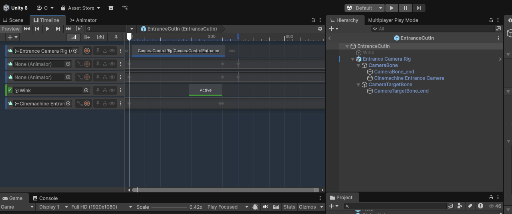

[農工大アドベントカレンダー2025](https://qiita.com/advent-calendar/2025/tuat)23日目の記事です。

ちょっと時間がなくて書く予定だった事が書けなくなったので Blender の話でお茶を濁します。

Blender素人なので、もっといいやり方があったら教えて下さい(全然ありそう)。

## 背景

学祭に向けてUnityでゲームを作っており、キャラクターの入場カットインを担当していました。

今まで、全てのカメラワークは Unity の Cinemachine (と Timeline) で作っていて、キャラクターアニメーションのみ Blender 製でした。

というのも、Cinemachine が大変便利で優秀で、Blenderのカメラなんて初めに消してしまうだけのものだと思っているような私には Cinemachine の方が快適に思えたからです。

## Blenderに寄せた方がいいのでは？

しかし、カメラを直してアニメーションを直して……とUnityとBlenderで往復してるうち、カットインは全部 Blender で作った方が良いのではないかと薄々感じ始めました。

というわけで、Unity に移せるカメラワークを作ろうという流れになりました。

## Blender でのカメラワークの作り方の検討

過去に適当にやったときは、カメラをパスに載っけて自動的にスライドさせ、カメラの注視点をキーフレームで移動させました。

この方法だと、fbx出力してもカメラの動きはアニメーションデータとしてのらないので、Unityに持ち出す事ができません。

## リグアニメーションにする

一旦カメラごとUnityに持ち出すという考えをやめました。

キャラクターのアニメーションと同じように、ボーンをアニメーションさせてfbxにしてしまえば扱いやすそうです。

ただ、やっぱりBlenderのカメラを使いこなすには知識不足なので、カメラの座標と、カメラの注視点の座標のアニメーションデータを作成することにし、実際に注視させる設定は Unity に持っていってから Cinemachine で行うことにします。

## 実際に作ったリグ

こんな見た目です。

このオブジェクトの中身は2つだけです。

- 注視点用のボーン(赤色)
- カメラ用のボーン(緑色)

扱いやすいように、ボーンはそれぞれ回転しないようなコンストレイントを入れています。
また、わかりやすいように、ボーンの見た目や色を変えています。

カメラにもコンストレイントを入れて、座標がカメラ用ボーンに追従するようにしています。

下に見えるのはキーフレームで、あるフレームでのボーンの座標をキーポイントとして記録しておくと再生時には線形に補完されます。
この構成だと、カメラ位置と注視点だけで全て決まるので、加速度が不連続な代わりに直感的にアニメーションを作れました。

## Unity での設定

このオブジェクトを fbx 形式で出力し、 Unity のシーンに配置します。
カメラ用のボーンオブジェクトの子要素に `Cinemachine Camera` を追加し、`Tracking Target` には注視点用のボーンオブジェクトを指定します。

あとは、Timeline などで、fbx のアニメーションを再生するだけです。

## 完成

キャラクターのアニメーションと合わせると Blender ではこんな感じになります。

最終的に完成したゲーム内ではこんな感じです。Timeline に多少エフェクトが追加されたりしています。

<iframe width="560" height="315" src="https://www.youtube.com/embed/TwIQHk3sJeo?si=6bVJsnoRsKQRAi1c" title="YouTube video player" frameborder="0" allow="accelerometer; autoplay; clipboard-write; encrypted-media; gyroscope; picture-in-picture; web-share" referrerpolicy="strict-origin-when-cross-origin" allowfullscreen></iframe>

ゼ○ゼロっぽいカットイン(かっこいいので作りたかった)。

## まとめ

カットイン制作を Blender に寄せ、カメラワークを Unity に持ち出す試みをした話でした。

こういうの、そもそも FBX とかじゃなくて USD でやるのが普通なんですかね。USD はいずれ触りたいです。
