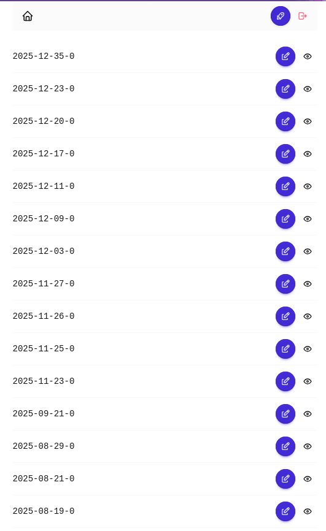

## モチベ

- このブログ上から記事を編集したり追加したりしたい。
- Astro の Live Collection を使ってみたい。

Live Collection に関しては、こんな紹介記事 [Astro新時代! 再ビルド不要のLive Content Collections](https://zenn.dev/katsuyuki/articles/69081373cf9f0b) があります。およそ1年前の記事ですが、まだ Experimental な機能です。

Astro は静的サイトジェネレーターとして知られていますが、
他のフロントエンドフレームワークと同じような機能も備えていて、案外使いやすいです。

## 概要

Astro の Content Collection とマークダウンを使った標準的なブログをベースに、管理画面をつけます。

- GitHub アカウントでログイン
- GitHub API で記事に関する操作
    - 記事一覧の取得
    - 記事の追加、編集、削除
- マークダウンエディタ
- Astro の Live Collection で記事の変更を即座にプレビュー

だいたいこんな感じの構成が目標となります。現時点では完全にはできあがっていないのですが、おおよその部分はできています。

## Astro Cloudflare Adapter の導入

何らかの Adapter を導入することで、サーバーサイドの処理が可能になります。Cloudflare Workers 上で動かすことを想定しているので、
[Cloudflare Adapter](https://docs.astro.build/en/guides/integrations-guide/cloudflare/) を使用します。

Cloudflare Adapter で画像周りの処理もできるのですが、一旦すべてのオプションは passthrough にしています。

## Better Auth の導入

Better Auth を選んだ理由は Astro の公式ドキュメントででてきたから、というだけです。

- [認証に関する Astro のドキュメント](https://docs.astro.build/en/guides/authentication/)
- [Better Auth のドキュメント](https://www.better-auth.com/docs/installation)
- [Astro に関する Better Auth のドキュメント](https://www.better-auth.com/docs/integrations/astro)

これらのドキュメントを見ながら進めます。ユーザーに GitHub リポジトリを編集できる権限を与えたいので GitHub OAuth App ではなく、GitHub App を作成しました。

データベースは使わない予定なので、jwt を使ったステートレスな認証にしました。

```ts title="src/middleware.ts"
export const onRequest = defineMiddleware(async (context, next) => {
    // `/admin/*` と `/api/auth` と `/login` に対して認証を行い、それ以外はスキップする
})
```

Next.js の middleware に似た感じで、認証が必要なルートに対して認証を行うようにしています。

## octokit の導入と記事一覧画面

GitHub API を扱いやすくするため、[octokit](https://www.npmjs.com/package/octokit) を導入します。

```ts
const response = await octokit.request(
    "GET /repos/{owner}/{repo}/contents/{path}",
    {
        owner: "ojii3",
        repo: "content",
    },
);
```

といった感じで `ojii3/content` リポジトリの中の一覧を取れるのでこれを、`export prerender = false` にした SSR なページで呼び出し、パースして表示します。管理画面にこだわりはないので、daisy UI を使って AI に適当な UI を書かせました。



## 記事のプレビュー画面

ここで Live Collection を使います。

先ほどのように `octokit` で GitHub API を叩き、マークダウンをパースする、というのを Live Collection のカスタムローダーの中に書きます。

残念ながら、現状 Content Collection と全く同じパーサーを使い回す方法はなさそうで、[gray-matter](https://www.npmjs.com/package/gray-matter) でフロントマターを抽出し、本文を Astro の `createMarkdownProcessor` に `astro.config.mjs` と同じオプションを指定して呼び出す形の運用をしています。

正直なところ、Live Collection を使う意味は余りありませんでした。特に、クライアントサイドでマークダウンのリアルタイムプレビューをつけるとしたらなおさら必要なくなりそうです。単に使いたかったから、というのと、強いていうならフロントマターのzodバリデーションが自動で効いてくれるくらいでしょうか。

## 記事の編集画面

