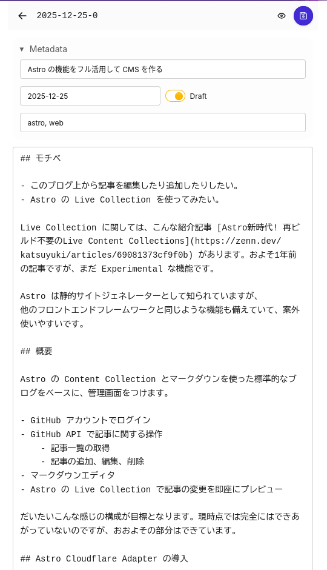

[農工大アドベントカレンダー](https://qiita.com/advent-calendar/2025/tuat) 最終日の記事です。遅刻してすみません。

前回の Astro の記事は [Astro Content Collection で外部の GitHub リポジトリを使う](/2025-12-11-0) という内容で、わずかに関連性があります。

## モチベ

- 楽に記事を編集したり追加したりしたい。
- Astro の Live Collection を使ってみたい。
- パースできるマークダウンやプレビューに差異がでるため、外部のヘッドレス CMS は使う気がしない。

などがあります。

## 目指すところ

Astro の Content Collection とマークダウンを使った標準的なブログをベースに、以下のような管理画面をつけます。

- GitHub アカウントでログイン
- GitHub API で記事に関する操作
    - 記事一覧の取得
    - 記事の追加、編集、削除
- マークダウンエディタ
- Astro の Live Collection で記事の変更を即座にプレビュー

こんな感じで、Netlify CMS や Decap CMS、TinaCMS ライクなものを Astro で、ブログに統合された形で作るのが目標です。
記事執筆時点では完全にはできあがっていないのですが、大枠の部分はできています。

## Astro Cloudflare Adapter の導入

何らかの Adapter を導入することで、サーバーサイドの処理が可能になります。Cloudflare Workers 上で動かすことを想定しているので、
[Cloudflare Adapter](https://docs.astro.build/en/guides/integrations-guide/cloudflare/) を使用します。

Cloudflare Adapter で画像周りの処理もできるのですが、一旦すべてのオプションは passthrough にしています。

## Better Auth の導入

Better Auth を選んだ理由は Astro の公式ドキュメントででてきたから、というだけです。

- [認証に関する Astro のドキュメント](https://docs.astro.build/en/guides/authentication/)
- [Better Auth のドキュメント](https://www.better-auth.com/docs/installation)
- [Astro に関する Better Auth のドキュメント](https://www.better-auth.com/docs/integrations/astro)

これらのドキュメントを見ながら進めます。ユーザーに GitHub リポジトリを編集できる権限を与えたいので GitHub OAuth App ではなく、GitHub App を作成しました。

データベースは使わない予定なので、jwt を使ったステートレスな認証にしました。

```ts title="src/middleware.ts"
export const onRequest = defineMiddleware(async (context, next) => {
    // `/admin/*` と `/api/auth` と `/login` に対して認証を行い、それ以外はスキップする
})
```

Next.js の middleware に似た感じで、認証が必要なルートに対して認証を行うようにしています。

## octokit の導入と記事一覧画面

GitHub API を扱いやすくするため、[octokit](https://www.npmjs.com/package/octokit) を導入します。

```ts
const response = await octokit.request(
    "GET /repos/{owner}/{repo}/contents/{path}",
    {
        owner: "ojii3",
        repo: "content",
    },
);
```

といった感じで `ojii3/content` リポジトリの中の一覧を取れるのでこれを、`export prerender = false` にした SSR なページで呼び出し、パースして表示します。管理画面にこだわりはないので、daisy UI を使って AI に適当な UI を書かせました。


これで記事一覧を見れるようになりました。

## 記事のプレビュー画面

ここで Live Collection を使います。 Live Collection に関しては、こんな紹介記事 [Astro新時代! 再ビルド不要のLive Content Collections](https://zenn.dev/katsuyuki/articles/69081373cf9f0b) があります。およそ1年前の記事ですが、現在もまだ Experimental です。


先ほどのように `octokit` で GitHub API を叩き、マークダウンをパースする、というのを Live Collection のカスタムローダーの中に書きます。

残念ながら、現状 Content Collection と全く同じパーサーを使い回す方法はなさそうで、[gray-matter](https://www.npmjs.com/package/gray-matter) でフロントマターを抽出し、本文を Astro の `createMarkdownProcessor` に `astro.config.mjs` と同じオプションを指定して呼び出し、UI のコンポーネントのみ再利用しています。

正直なところ、Live Collection を使う意味は余りありませんでした。特に、クライアントサイドでマークダウンのリアルタイムプレビューをつけるとしたらなおさら必要なくなりそうです。単に使いたかったから、というのと、強いていうならフロントマターのzodバリデーションが自動で効いてくれるくらいでしょうか。

## 記事の編集画面

フォームのUIを作って初期値を入れる部分はプレビュー画面と違いありません。

「ボタンを押して保存する」といった処理はクライアントサイドからサーバーサイドへリクエストを送り、サーバーサイドで GitHub API を叩いてマークダウンファイルを更新します。
Astro の [Server Actions](https://docs.astro.build/en/guides/actions/) を使いました。入力に `zod` のバリデーションが入る rpc 的な仕組みです。

また、マークダウンの編集を保存する、つまりコミットするにあたり、GitHub の User Access Token が必要になります。
先述の Better Auth と GitHub App の設定とインストールが正しくできていれば、Better Auth のクライアントを使って User Access Token を取得できます。

```ts
import { auth } from "@/auth";

export const getGitHubAccessToken = async (
	headers: Headers,
): Promise<string> => {
	const response = await auth.api.getAccessToken({
		headers,
		body: { providerId: "github" },
	});

	const accessToken = response?.accessToken;
	if (!accessToken) {
		throw new Error(
			"GitHub のアクセストークンを取得できませんでした。再ログインしてください。",
		);
	}

	return accessToken;
};
```

以下のようにして、`Octokit` のインスタンス作成時に渡すことができます。

```ts
new Octokit({
    auth: accessToken,
    userAgent: USER_AGENT,
    request: {
        fetch,
    },
});
```

このアクセストークンを使って、Server Actions を定義します。

```ts title="src/actions/index.ts
const updatePostInput = z.object({
	slug: z.string(),
	frontmatter: z.object({
		title: z.string(),
		date: z.string(),
		tags: z.array(z.string()).optional(),
		draft: z.boolean().optional(),
	}),
	body: z.string(),
	sha: z.string().optional(),
});

export const updatePostHandler = async (
	{ slug, frontmatter, body, sha }: z.infer<typeof updatePostInput>,
	context: ActionAPIContext,
) => {
    // GitHub の User Access Token を取得し、GitHub API を叩いて記事を更新する
}

export const triggerDeployHandler = async (
    _: undefined,
    context: ActionAPIContext,
) => {
    // GitHub API を叩いてリポジトリのワークフローを手動で起動する
}

export const server = {
	updatePost: defineAction({
		accept: "json",
		input: updatePostInput,
		handler: updatePostHandler,
	}),
	triggerDeploy: defineAction({
		accept: "json",
		handler: triggerDeployHandler,
	}),
};
```

クライアント側からはこんな感じで呼びだせます。

```astro
<script>
import { actions } from "astro:actions";

form.addEventListener("submit", async (event) => {
    event.preventDefault();

    const formData = new FormData(form);
    const frontmatter = buildFrontmatter(formData);
    const body = formData.get("body");

    try {
        await actions.updatePost({
            slug,
            frontmatter,
            body: typeof body === "string" ? body : "",
            sha,
        });
    } catch (error) {
        console.error(error);
    }
});
</script>
```

あとは daisy UI と AI のセンスで適当な UI を作成しました。



これで記事の編集もできるようになりました！

## まとめ

以下のようなものを新たに使ってCMS(っぽいもの)を作ってみました。

- On Demand Rendering (SSR)
- Live Collection
- Server Actions
- Better Auth

長らくフロントエンドに触ってきておきながら、AuthやSSRをやるのは初めてな気がします。
今後は

- 記事の追加・削除を実装する
- ただのTextareaではなく、少しリッチなマークダウンエディタを導入する
- 画像を管理できるようにする

など、のんびり進めていきたいと思っています。

## おわりに

Astro 楽しいぞよ！
