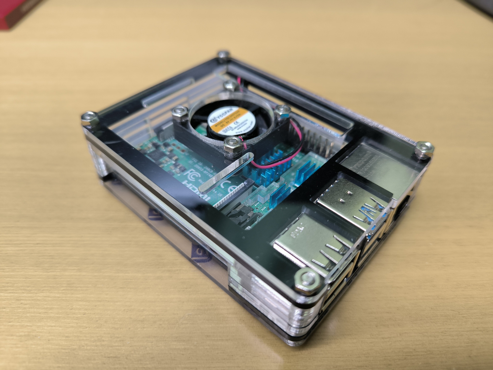
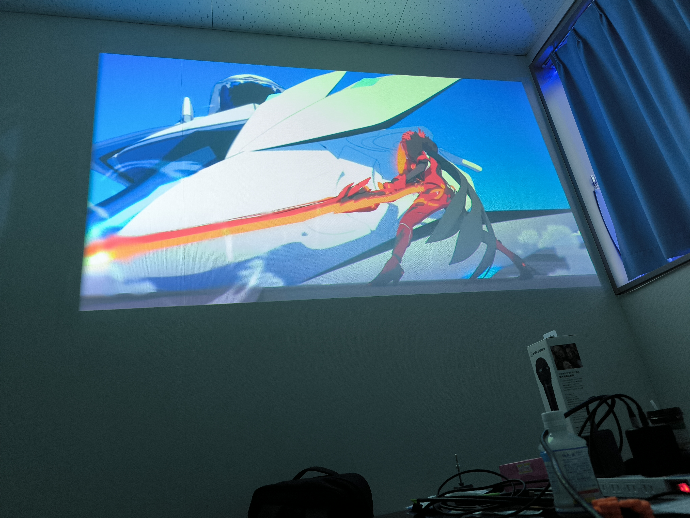

昨年に引き続き、今年の振り返りです。大学ではMCCというサークルに所属していて、MCC関連の話が多いです。

## 崩壊がアツい

崩壊スターレイルの予告でオンパロスが来てから、熱心に崩壊3rdとスターレイルをプレイしていました。初めてゲームにお金を貢いだ。

キアナちゃんかわいい

## 技育搏に出展した

昨年秋の農学部祭でMCC内で制作したゲーム「RicoShot」を技育搏に出展し、DeNA賞をいただきました。

まぁ後輩たちをこういうイベントに連れていくという名目で。

## ラズパイ入手

Raspberry Pi 4b を先輩から安く譲ってもらいました。

NixOSを入れたりAndroidを入れたりして遊びつつ、同じくラズパイ制御の部室の入退室システムにサーボで施錠機能を足す際のテスト機に使いました。

## 留年が確定した

めいっぱい履修していて、フル単すれば留年回避という状態でレポートを出す科目を間違えていたらしいです。

「基礎回路演習」とかいう誰も落単しない科目に「関数プログラミング」のレポートを出して落単、見事に留年確定！研究室も追い出されました orz。

言い訳をすると、**機械系から情報系への3年次編入で単位互換があまり効いていなかった**というのがあります。

そこそこがんばったのにナ～～

## マイクラ

2,3月頃はMCC内でマイクラが流行っていて、人生初マイクラにハマっていました。

## MCC合宿

部長が留年とはいえ、世代交代はするもので、時期部長に丸投げした記憶があります。

例年のごとく、2泊3日で各チーム何か作るハッカソンをやり、ブラウザで動くARマイクラを作った気がします。

## 工学部祭

農学部祭と同じノリでゲーム作ろうとしたら失敗しました。敗因はマイクラのやり過ぎです。

もっと後輩の面倒見ようね。

## Tech Circle Expo #6

持ち回りの大学横断型技術交流イベントということで、Tech Circle Expo (てくさー)の主催をしました。ちらほらと周りに手伝ってもらいながら、開場確保&配信準備&告知&司会&登壇などをしました。

準備の都合でプロジェクターを調達したよ。

姫子先生かっこいい

## 
