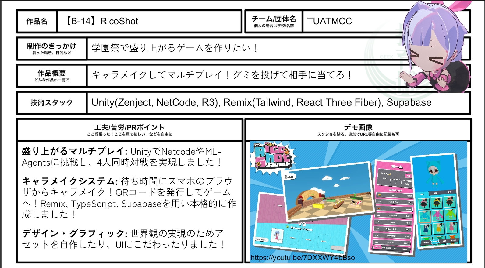
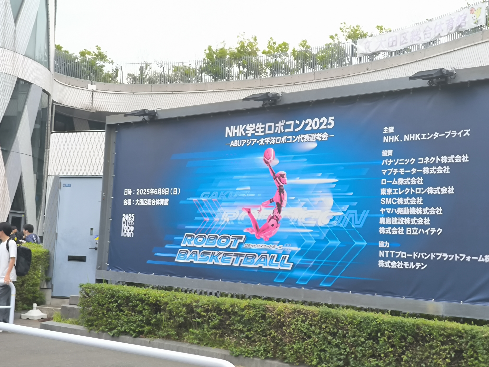
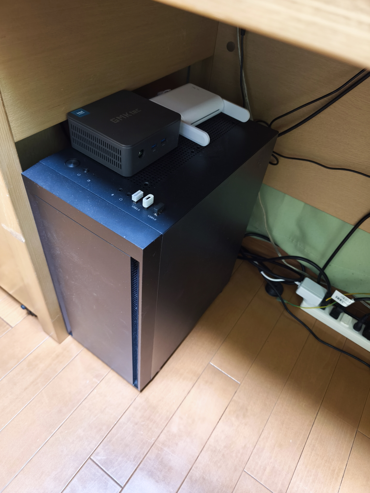
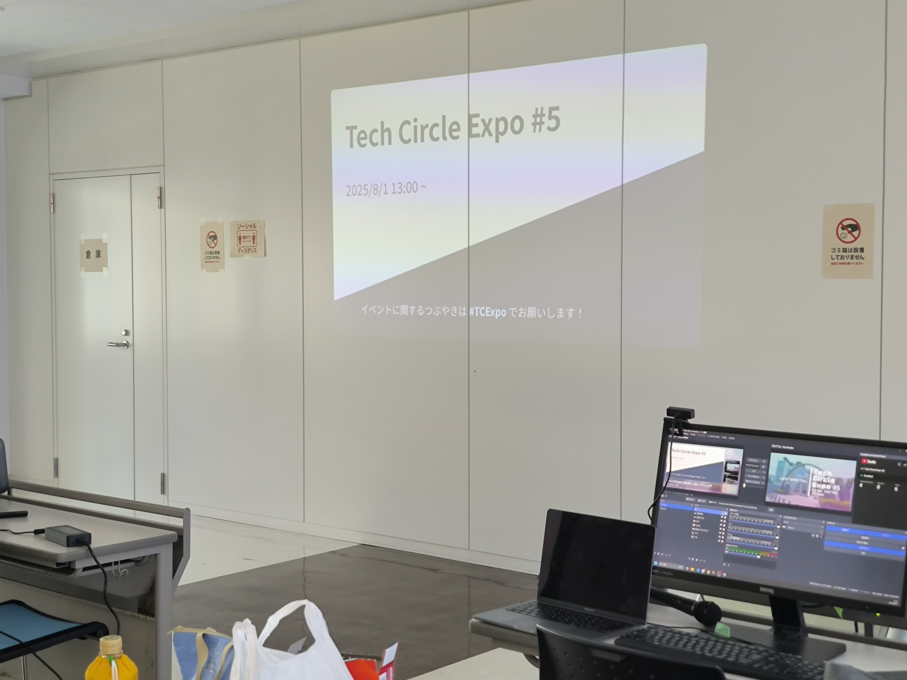
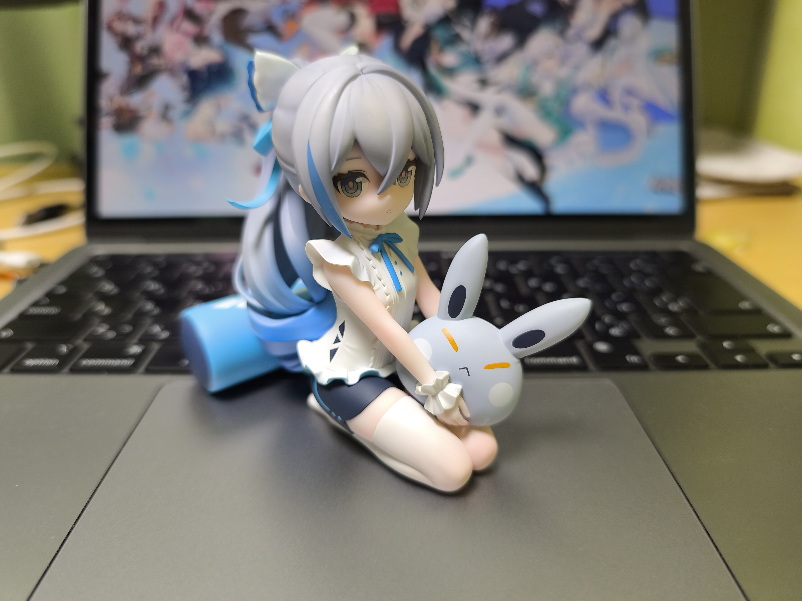
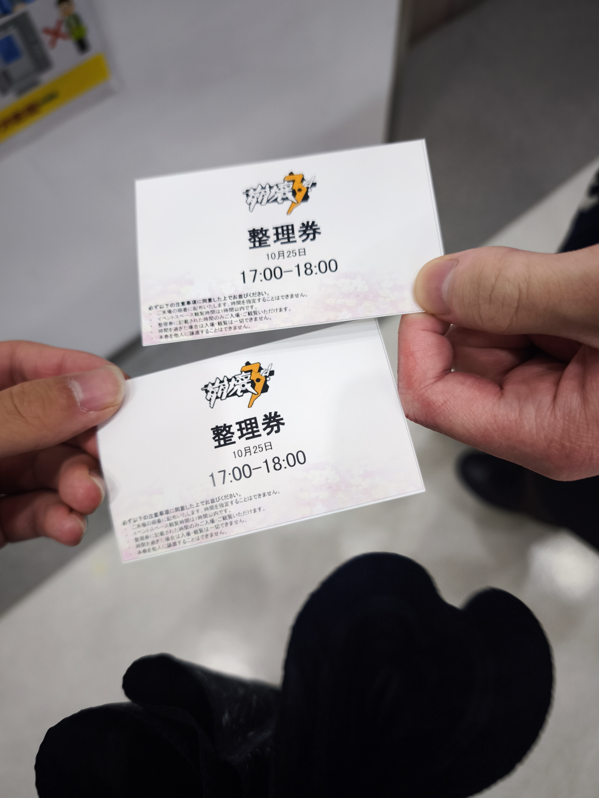

昨年に引き続き、今年の振り返りです。大学ではMCCというサークルに所属していて、MCC関連の話がよく出てきます。

## 崩壊がアツい

崩壊スターレイルでオンパロスが来てから、熱心に崩壊3rdとスターレイルをプレイしていた。

あと流石に声も楽しみたくなってスタレの言語を英語から日本語にした。

キアナちゃんかわいい

## 技育搏に出展した

昨年秋の農学部祭でMCC内で制作したゲーム「RicoShot」を技育搏に出展し、DeNA賞をいただいた。

## ラズパイ入手

Raspberry Pi 4b を先輩から安く譲ってもらった。

NixOSを入れたりAndroidを入れたりして遊びつつ、MCC部室の入退室システムにサーボで施錠機能を足す際のテスト機に使ったりしていた。

## Mac Book 入手

諸事情により親から譲ってもらうことになった。早速 Nix を入れた。タイル型WMはMacに合わなくてて入れはしたけどやめた。

なんだかんだMacが必須な場面は Adobe Substance 3D Painter くらい、要は3Dモデリングのときだけで、あとは Linux 必須の開発をするかどうかで決めている。手広く技術をやっているとLinux必須な場面が結構あるんですよ。

## 留年が確定した

めいっぱい履修していて、フル単すれば留年回避という状態で、レポートを出す科目を間違えていた。しかもレポート出しさえすれば単位が来る1年生の科目。

ギャグが上手すぎて笑いが止まらない。

機械系から情報系への3年次編入で単位互換があまり効かなかった(これは事実)という言い訳を建前にして生きていく所存です。

そこそこがんばったのにナ～～！！

## マイクラ

2,3月頃はMCC内でマイクラが流行っていて、人生初マイクラにハマっていた。

## MCC春合宿

部長が留年とはいえ、世代交代はするもので、時期部長に丸投げした記憶がある。

例年のごとく、2泊3日で各チーム何か作るハッカソンをやり、今回はブラウザで動くARマイクラを作った気がする。

## 工学部祭

農学部祭と同じノリでゲーム作ろうとしたら失敗しました。敗因はマイクラのやり過ぎ。

もっと後輩の面倒見ようね。

でも完成は完成だから(暗示)。

## NHK学生ロボコンの応援

会場のWi-Fi設営ボランティアと当日の後輩たちの応援をした。 ロボ研部室に顔出してなさすぎて知らない子たちばっかりだけど。

今年も準決勝進出、母校がロボコン強いのはとても幸せなことだね。応援しがいがある。感動。

## Mini PC を入手

趣味の幅を広げるために買った。

自宅サーバーとして常時稼働させている。12月現在、Proxmox の上に Tailnet 用の DNS サーバー兼広告ブロッカーのLXCとと汎用NixOSが載っている。

## Tech Circle Expo #5

持ち回りの大学横断型技術交流イベントということで、Tech Circle Expo (てくさー)の主催をした。ちらほらと周りに手伝ってもらいながら、開場確保&配信準備&告知&司会&配信管理&登壇などをしていた。

準備の都合でプロジェクターを調達したよ。

姫子先生かっこいい

## MCCホームページリニューアル

以前のを作ったのも私だけど、長らく直したいと思っていた部分が多かった。Next.js のバグを踏んで嫌な気持ちになったのとその他諸々の理由で Astro で全て作り直した。

[tuatmcc.com (PC推奨)](https://tuatmcc.com)

デザインはとても未熟だけど、やりたい表現があったというのが伝われば嬉しい。

## 崩壊がアツい2

サフェル実装です。猫耳かわいいね。

というわけで(?)、パルドフェリスのお誕生日絵を描いた。

個人的には模写以外で漕いめの影を塗ったのは初めてなのでたぶん成長です。

あと1年くらい前に注文してたブロにゃんが来ました。フィギュア買ったの初めて。

かわいい

## MCC夏合宿

また2泊3日の合宿です。参加希望出したとき競プロ熱が高めだったのでハッカソンではなく初めての競プロ枠でした。

普通に楽しかった。成長は特にないかな。

## 農学部祭

3Dキャラクター作りの担当になった。早めの段階で焦りから本気を出して睡眠を少しづつ削り始めた。キャラデザ、モデリング、リギング、テクスチャ、モーション作成からシェーダーやインゲームのキャラ制御、カットインまで一通りやった(偉い)。

こなしたタスクから言えば、個人的な満足度は高め。

ただ、私がクオリティにこだわりすぎているのと、サークルとしてのチーム開発のあり方とか、技術継承とか、色々思うところの多い結果となった。

ついでにboothに自作モデルを置くという実績を解除した。サークル垢だけど。

[MCCちゃん(SpellRush仕様)](https://booth.pm/en/items/7665572)

## KAINA

学祭期間中、ロボ研の制御屋同期が進めているロボットハンド(KAINA)のプロジェクトに誘われていた。学祭が終わって落ち着いたので参加した。

ヒューマノイドっていいよね。子供の頃からの夢だし。

ただこれだけは言わせて欲しくて、Ubuntu が本当にイヤです。こんな世の中は間違っている。

## 崩壊がアツい3

エリシア誕生日からのキュレネ実装らへんで盛り上がってきた(というか、運営が盛り上げている)

時系列ではもうちょっと前だけど、友達を連れて秋葉原のイベントに参加してきた。こういうの初めて。

あと、またお誕生日絵を描いた。

## Nixpkgs に PR を出した

欲しいパッケージがあったので NixPkgs に Pull Request を投げた。めちゃくちゃ丁寧なレビューが返ってきて感動した。まだ approve が進んでないのでマージはされていないけど。

## アドカレ

[農工大アドカレ2025](https://qiita.com/advent-calendar/2025/tuat) に6記事寄稿した。内容は Unity, Blender, Nix, ROS, Astro などなど。

特に Astro ネタはこのブログを改修しながら書いていた。アドカレ書くために夜更かししていたら生活習慣が狂ってしまった。調子に乗りすぎ。

## 新しいコト

まだここには書けないが、新しいコトを始めることになった。とても貴重な機会をもらった。

後先考えず今やりたいことだけやって生きてるけど、いわゆる後悔のない選択ってやつをしていると思う。

今の選択の責任はきっと未来の私が取ってくれるから。

## まとめ

だらだらと生きてる割に、まとめて見ると色々やってて面白い。問題は順調に歳を取ってることくらい。

来年も幸せな1年になりますように。
